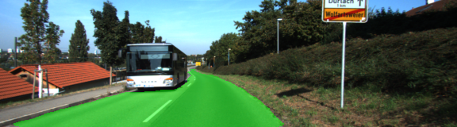
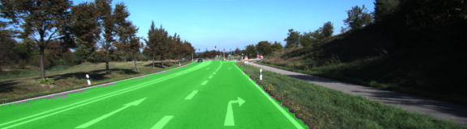
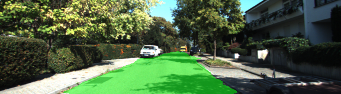
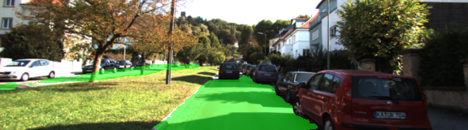

**Semantic Segmentation** 

In this project, pixels of a road in images are labeled using a Fully Convolutional Network (FCN). I started with the VGG16 network and added skip layers, 1x1 convolutions and upsampling to build the FCN.

This implementation is based on the 2015 paper [Fully Convolutional Networks for Semantic Segmentation](https://arxiv.org/abs/1605.06211) from UC Berkeley. As for the framework, TensorFlow is used. The network has been trained on an Amazon p2.xlarge GPU instance with around 11GB of graphic memory. The batch size of 48 uses almost everything of that memory and the network is trained for 40 epochs, which takes about an hour. 

As regularization, dropout with a drop-rate of 20% is used together with a L2-regularizer for the kernel weights of the decoder convolutions. Adam is used as optimizer, because is a good choice for most deep learning projects. The loss decreases the most in the first ten epochs. Afterwards, it is more like a fine-tuning to get smooth edges for the road pixel labeling, the final loss value is at around 0.02. This project was part of term 3 of the Udacity [self-driving car](https://www.udacity.com/drive) nanodegree program.

Example images:










Make sure you have the following is installed:
 - [Python 3](https://www.python.org/)
 - [TensorFlow](https://www.tensorflow.org/)
 - [NumPy](http://www.numpy.org/)
 - [SciPy](https://www.scipy.org/)

Download the [Kitti Road dataset](http://www.cvlibs.net/datasets/kitti/eval_road.php) from [here](http://www.cvlibs.net/download.php?file=data_road.zip).  Extract the dataset in the `data` folder.  This will create the folder `data_road` with all the training a test images. The frozen VGG network is downloaded automatically on the first run and extracted.

Run the following command to execute the project:
```
python main.py
```

